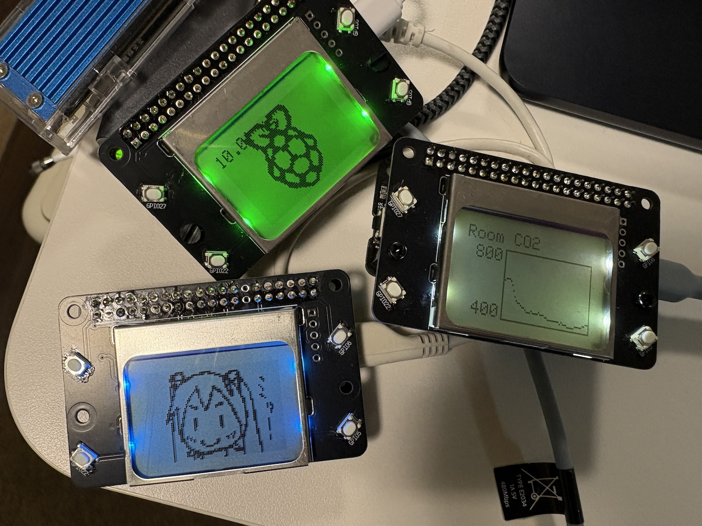
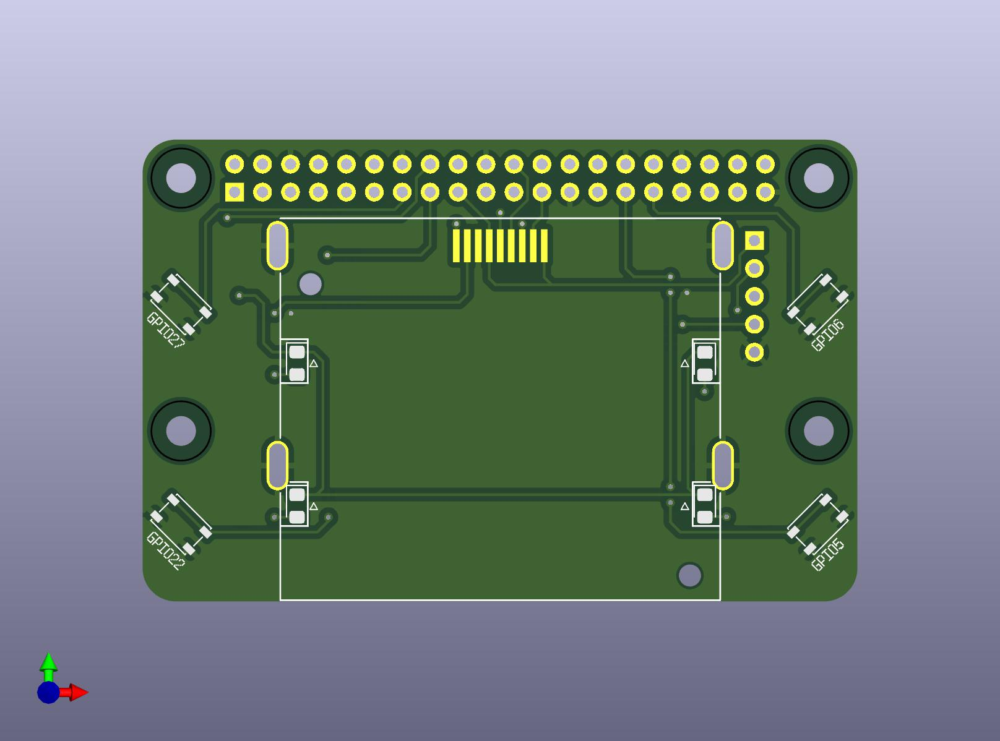
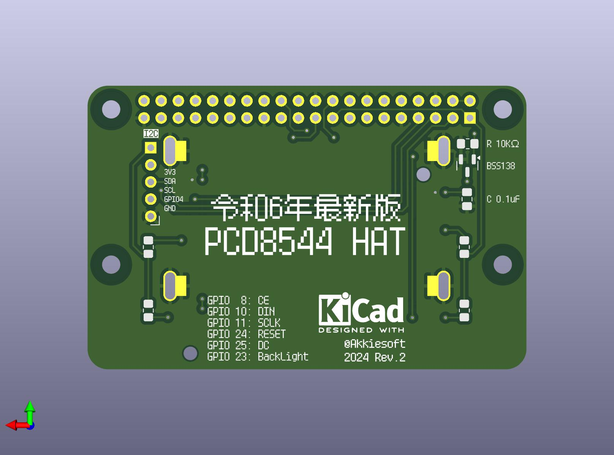

# 令和6年最新版 PCD8544 HAT

PCD8544 (a.k.a. Nokia5110) ディスプレイをRaspberry Piで使用するための拡張ボードです。84x48しかないレトロなモノクロLCDでグラフィック表示を楽しんでみませんか？

## 特徴

* Raspberry Piの標準的なSPIピンに配線
* GPIOで制御可能なバックライト
* uHAT規格のマウントホールを用意 (ボードサイズはuHATよりももう少し大きいです)
* 4つのボタンを配置

## サンプルスクリプト

サンプルスクリプトはCircuitPythonで記述されています。

* pcd8544_demo.py
    * 基本的なデモスクリプトです
    * 左上のボタンを押すとバックライトのオン・オフ切り替え
    * 左下のボタンを押すとグラフ表示ライブラリのサンプルを表示
    * 右上と右下のボタンを押すと画像データを表示

## ライブラリ

いずれもpcd8544_demo.pyで使用例が確認できます。

* draw_img
    * フレームバッファ形式に合わせた画像の配列データを描画します
* draw_graph
    * グラフを描画します

## ユーティリティスクリプト

* img_convert.py
    * 84x48の画像を、draw_imgライブラリで描画可能な配列形式に変換します

## 基板データ

TBD

## 部品リスト

* 1x BSS138
    * https://akizukidenshi.com/catalog/g/g111627/
* 1x 0.1uF 積層セラミックコンデンサー
    * https://akizukidenshi.com/catalog/g/g117576/
* 1x 10KΩ表面実装抵抗 (2012/0805サイズ)
* 4x 330Ω表面実装抵抗 (2012/0805サイズ)
    * LED用。LEDに合わせて適宜変更してください
* 4x 表面実装LED (2012/0805サイズ)
    * https://akizukidenshi.com/catalog/g/g106423/
    * https://akizukidenshi.com/catalog/g/g106424/
    * https://akizukidenshi.com/catalog/g/g106425/
* 4x 表面実装ボタン (3mm * 4mm * 2.5mm)
    * https://aliexpress.com/item/1005004888773791.html
* PCD8544
    * https://aliexpress.com/item/1005005594822679.html

## Used libraries and footprint

* [KiCad footprint for Nokia 5110 LCD](https://hackaday.io/page/3427-kicad-footprint-for-nokia-5110-lcd)
    * by sgreg, MIT License

## License

令和6年最新版 PCD8544 HAT (PCD8544 HAT in 2024)

2024 @Akkiesoft, MIT License
